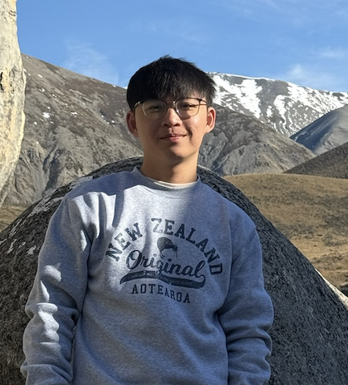
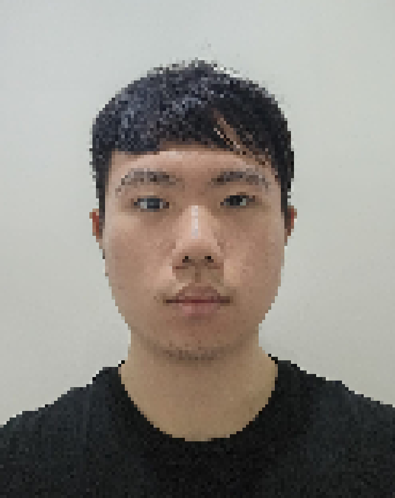
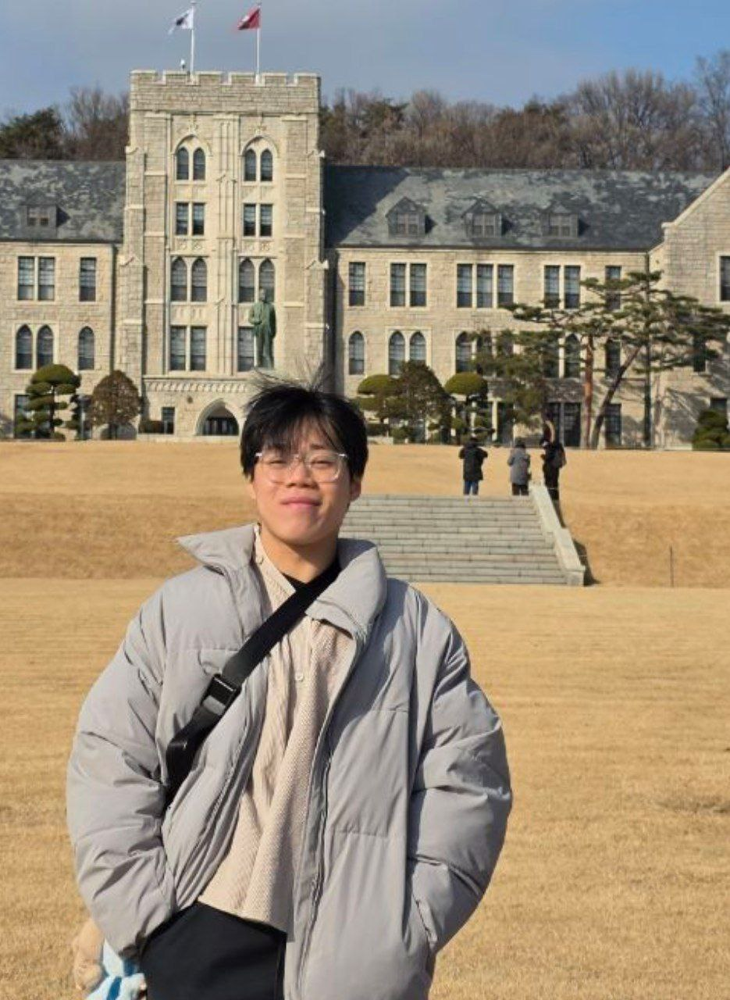

We are a team based in the [School of Computing, National University of Singapore](https://www.comp.nus.edu.sg).

You can reach us at the email `seer[at]comp.nus.edu.sg`

## Project team

### Jie Sheng

[[github](https://github.com/Depsheng)]

* Role: Project Advisor
* Responsibilities: UI/logic
* Hobbies: Gym, Video Games

### Dylan Yeo

[[github](https://github.com/dylanyeo20)]
[[portfolio](team/johndoe.md)]

* Role: Team Lead
* Responsibilities: Logic 

### Ze Le

[[github](Just-Chocomint)] 

* Role: Developer
* Responsibilities: UI/Logic
* Hobbies: Video Games

### Hanwah

[[github](https://github.com/hanwah)]
[[portfolio](team/johndoe.md)]

* Role: Developer
* Responsibilities: Dev Ops + Threading
* Hobbies: Gym + Running

### Melville Lee

[[github](http://github.com/Melvilleleesy)]
[[portfolio](team/johndoe.md)]

* Role: Developer
* Responsibilities: UI, testing, documentation
* Hobbies: Walking at 6am
